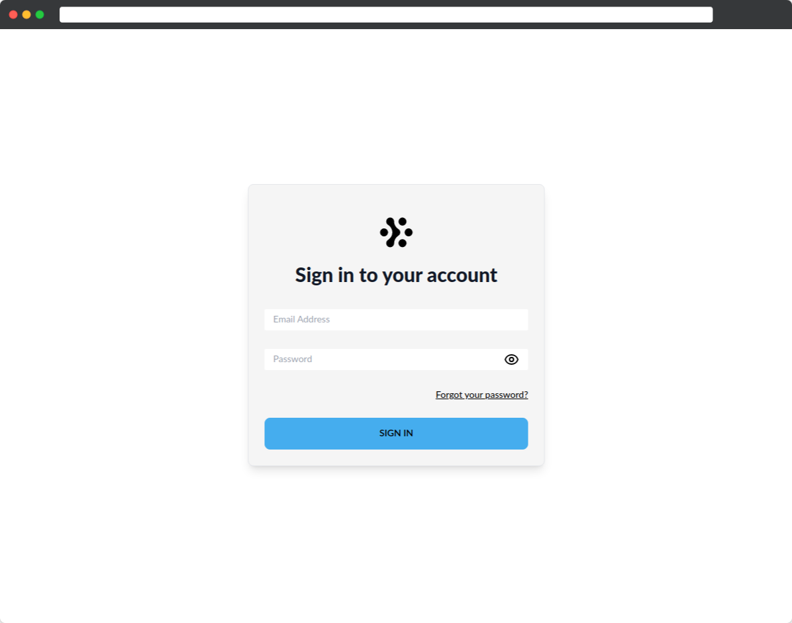
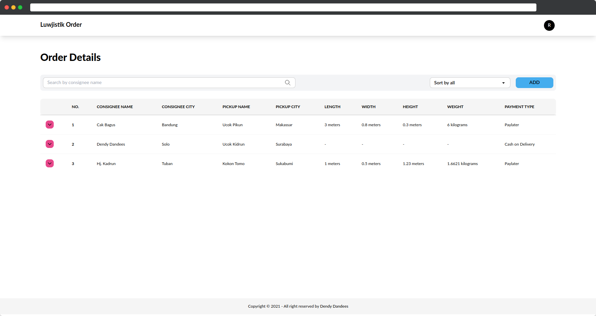

<div align="center">
  
</div>
<h1 align="center">
  Dendy Dharmawan
</h1>
<p align="center">
  <a href="https://dendydharmawan.thedev.id/" target="_blank">dendydharmawan.thedev.id</a>
</p>

</br>
</br>
</br>

# Order App

Website used to create and view order items

Url: [https://luwjistik-orders.vercel.app/](https://luwjistik-orders.vercel.app/)

## Authors

- [@dendydandees](https://github.com/dendydandees)

## Features

- Authenticator
- Search and sort order details
- Add new order

## Acknowledgements

- [Nuxt.js v2.15.8](https://nuxtjs.org/)
- [Tailwind Css](https://tailwindui.com/)
- [Daisy UI](https://daisyui.com/)

## Environment Variables

to run this project you need to create an `.env` file and copy the `.env.example` into the `.env`.

## Run Locally

Clone the project

```bash
  git clone https://github.com/dendydandees/order-app.git
```

Go to the project directory

```bash
  cd order-app
```

Install dependencies

```bash
  yarn install
```

Start the server

```bash
  yarn dev
```

## Demo

<div align="center">

</div>

<div align="center">

</div>
